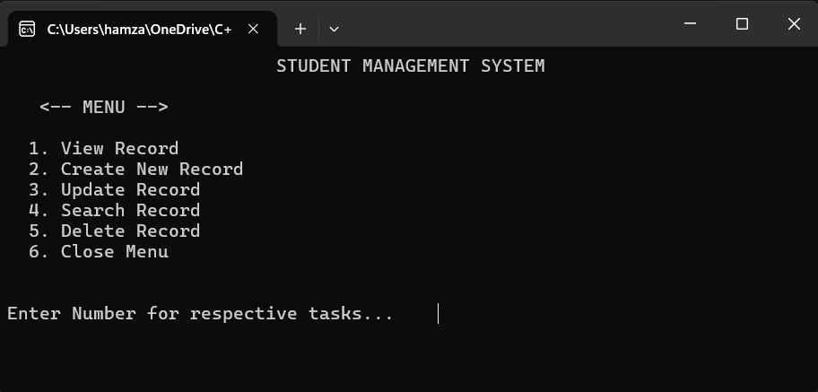
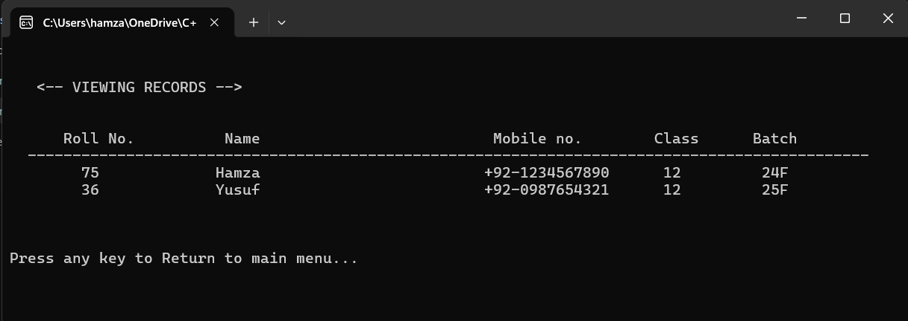

# C++  Projects

A collection of C++ programs built while learning core programming concepts.

<br/>

## Featured Project: Student Management System
 
A console-based Student Management System written in C++, using binary file I/O to persist student records.
 


 
**Features**
- Add new student records (roll no., name, mobile, class, batch)
- View all saved records
- Search a record by roll number
- Delete a record by roll number
- Records persisted to disk with binary file I/O (`record.txt`)
**Build & Run**
```bash
g++ final-sms.cpp -o final-sms
./final-sms
```
Built and tested on Windows (MinGW/GCC), since it uses `windows.h` and `conio.h`.

## Other Projects
| Project | Description |
|---|---|
| **Project 1 - Calculator** | Basic calculator for arithmetic and trignometric operations. |
| **Project 2 - Student Management System** | A console-based Student Management System *(featured above)*. |

## Author

Muhammad Hamza - [github.com/Hamzaa09](https://github.com/Hamzaa09)
